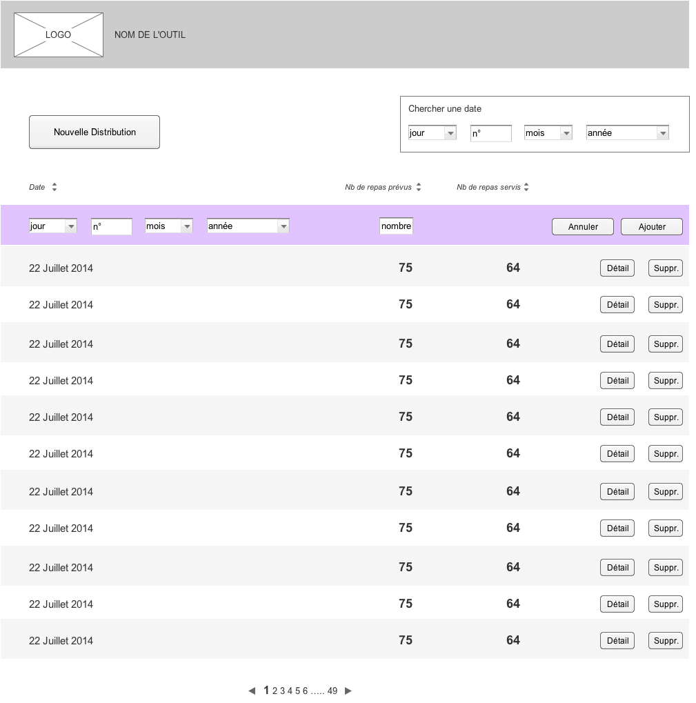
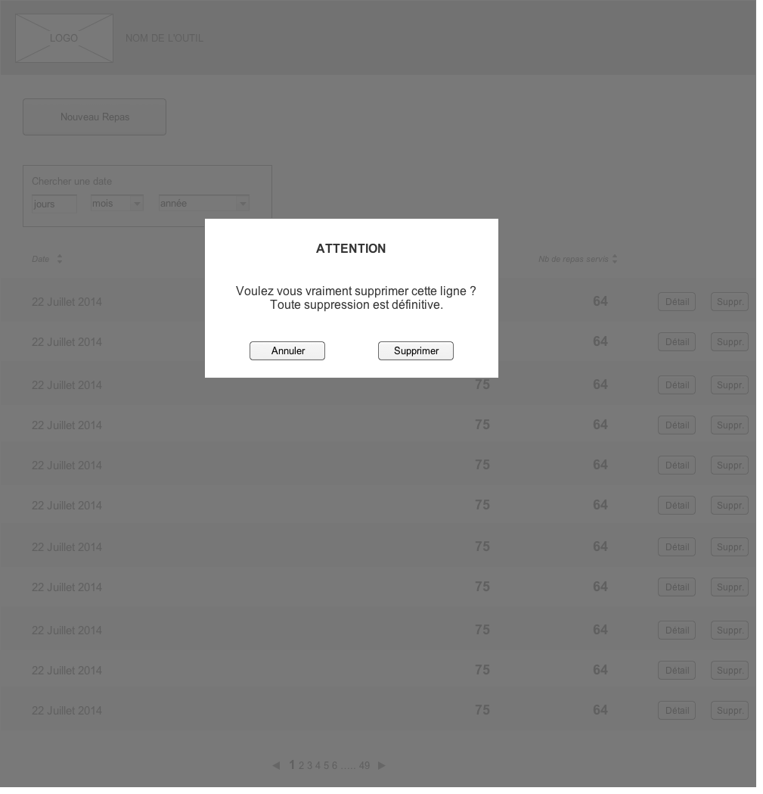
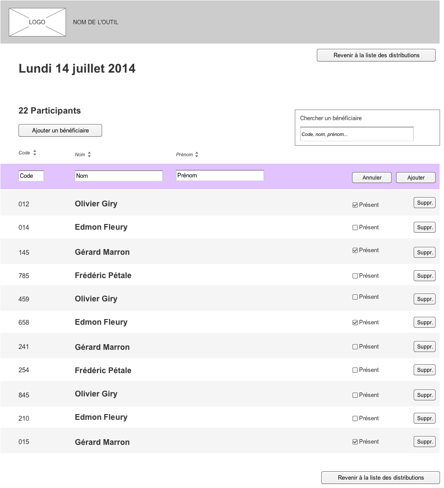

les-mardis-d-olivier
====================

## Backlog

[trello](https://trello.com/b/hlFnNTi4/resto-du-coeur)

## Screenshots


---

---


## Tests

Tests are using the karma test framework with jasmine. You can either install karma on you dev environment or use docker.

### Run tests with karma

 - Install karma: `npm install --save-dev`
 - Run tests: `npm test`

### Run tests with docker

It uses a container to run karma with the `karma.js` configuration file.

```sh
docker run -v $(pwd):/karma tiokksar/karma
```
